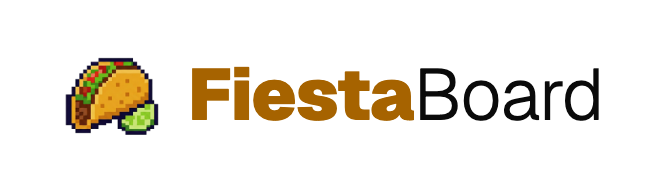
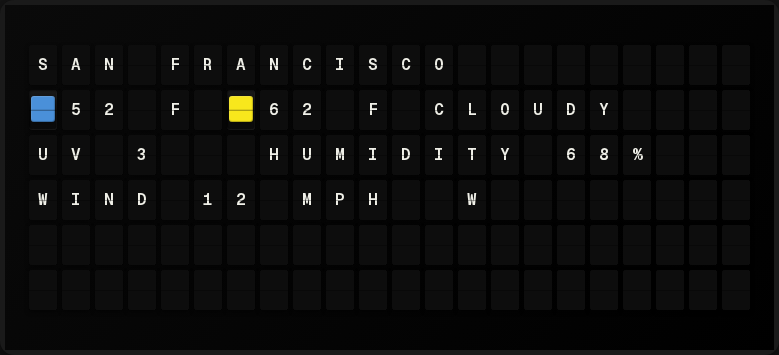
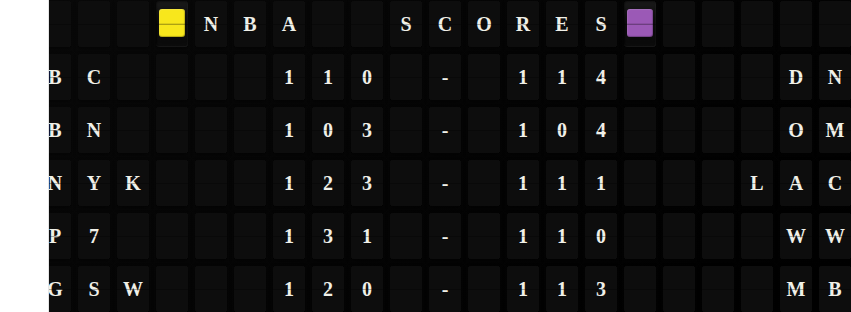
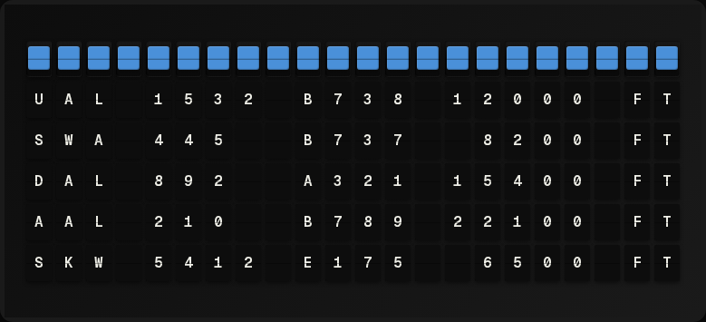
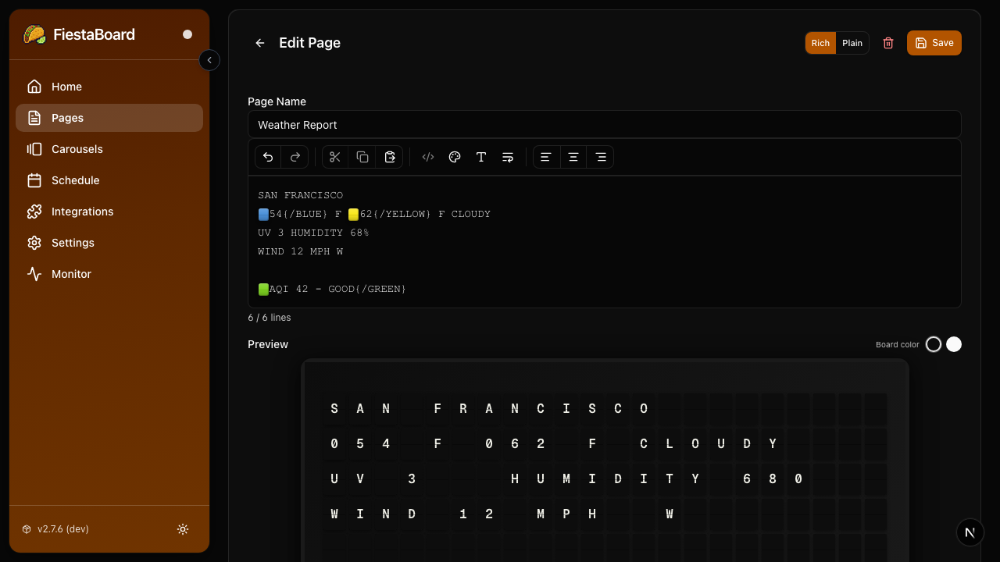
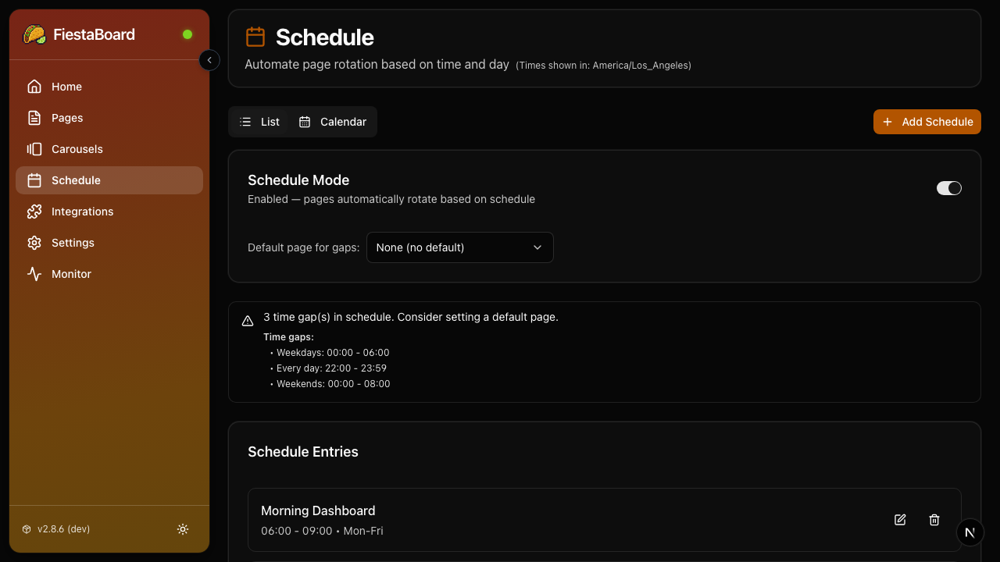

<p align="center">
  <picture>
    <source media="(prefers-color-scheme: dark)" srcset="docs-site/static/img/branding/logo-lockup-dark.png">
    <source media="(prefers-color-scheme: light)" srcset="docs-site/static/img/branding/logo-lockup-light.png">
    
  </picture>
</p>

<p align="center">
  <a href="https://opensource.org/licenses/MIT"></a>
  <a href="https://github.com/Fiestaboard/FiestaBoard/actions/workflows/ci.yml"></a>
  <a href="https://hub.docker.com/r/fiestaboard/fiestaboard"></a>
  <a href="https://fiestaboard.app"></a>
  <a href="https://discord.gg/ujasGntNhQ"></a>
</p>

**FiestaBoard is free, open-source software for Vestaboard and split-flap displays.** It gives you a self-hosted platform with a plugin system to pull in data from the sources that matter to you - weather, stocks, transit, sports, surf conditions, and more - and display it on your board. Compatible with Vestaboard Flagship (22x6) and Note (15x3).

You bring the board. You bring the API keys for the services you care about. FiestaBoard handles the rest.

**[Full Documentation](https://fiestaboard.app)** &nbsp;|&nbsp; **[Discord Community](https://discord.gg/ujasGntNhQ)**

---

## Get Started in 5 Minutes

**All you need:** Your board's API key + [Docker](https://docs.docker.com/get-started/get-docker/) installed.

### Easiest: Pull from Docker Hub (no clone needed)

```bash
# 1. Download the compose file
curl -O https://raw.githubusercontent.com/Fiestaboard/FiestaBoard/main/docker-compose.hub.yml

# 2. Start FiestaBoard
docker-compose -f docker-compose.hub.yml up -d
```

Open **http://localhost:4420** in your browser, connect your board, and you're running.

### Alternative: Clone and use the install wizard

```bash
git clone https://github.com/Fiestaboard/FiestaBoard.git
cd FiestaBoard

# Mac/Linux
./scripts/install.sh

# Windows (PowerShell)
.\scripts\install.ps1
```

The wizard collects your board API key, starts the server, and opens the setup page in your browser.

> **New to Docker or the terminal?** Follow the detailed [Beginner's Guide](https://fiestaboard.app/docs/setup/beginners-guide) for step-by-step instructions with screenshots.

### After Setup

1. Open **http://localhost:4420** — the setup wizard will guide you through connecting your board
2. The display service starts automatically once your board is connected
3. Go to **Integrations** to enable plugins (weather, stocks, etc.)
4. Go to **Pages** to create and design what your board displays
5. Go to **Schedule** to automate when different pages show up

> **Tip:** Many plugins need no API key at all - Date & Time, Star Trek Quotes, Guest WiFi, Visual Clock, Sun Art, and more work right out of the box. Start with those while you gather API keys for others.

> **Accessing from other devices:** FiestaBoard advertises itself on your local network via mDNS/Bonjour, so you can open **http://fiestaboard.local:4420** from any device on the same network. If `.local` addresses don't work on your network, use your server's IP address instead (e.g. `http://192.168.1.50:4420`).

---

## What Can You Display?

FiestaBoard has **26 built-in plugins** covering weather, finance, transit, sports, entertainment, and home automation. Here's what they look like:

**Weather** - Temperature, UV index, precipitation, high/low, sunset time



**Stocks** - Real-time prices with color-coded change indicators


**Sports Scores** - Recent match scores from NFL, Soccer, NHL, and NBA



**Nearby Aircraft** - Real-time aircraft info with call signs, altitude, and speed



### All Available Plugins

| Plugin | What It Shows | API Key? |
|--------|--------------|----------|
| [Weather](./plugins/weather/README.md) | Temperature, UV, precipitation, high/low | Yes (free) |
| [Stocks](./plugins/stocks/README.md) | Stock prices with color indicators | Optional |
| [Sports Scores](./plugins/sports_scores/README.md) | NFL, Soccer, NHL, NBA scores | Optional |
| [Traffic](./plugins/traffic/README.md) | Travel time with live traffic | Yes (free tier) |
| [Muni Transit](./plugins/muni/README.md) | Real-time SF Muni arrivals | Yes (free) |
| [Home Assistant](./plugins/home_assistant/README.md) | Smart home status (doors, locks, garage) | Yes (self-hosted) |
| [Last.fm Now Playing](./plugins/last_fm/README.md) | Currently playing music | Yes (free) |
| [Surf Conditions](./plugins/surf/README.md) | Wave height and quality ratings | No |
| [Air Quality & Fog](./plugins/air_fog/README.md) | AQI and fog conditions | Yes |
| [Nearby Aircraft](./plugins/nearby_aircraft/README.md) | Real-time aircraft tracking | Optional |
| [Disney Park Queue Times](./plugins/disney_parks_times/README.md) | Wait times for Disney rides | No |
| [WSDOT Ferries](./plugins/wsdot/README.md) | WA State ferry schedules and alerts | Yes (free) |
| [Bay Wheels](./plugins/baywheels/README.md) | Bike availability at stations | No |
| [Countdown](./plugins/countdown/README.md) | Time remaining until an event | No |
| [Date & Time](./plugins/date_time/README.md) | Current date/time in many formats | No |
| [Generic Data](./plugins/generic_data/README.md) | Custom data from any JSON/XML URL | No |
| [Guest WiFi](./plugins/guest_wifi/README.md) | WiFi credentials for guests | No |
| [Allergy & Health](./plugins/health/README.md) | Allergy levels and health risk indicators | No |
| [Star Trek Quotes](./plugins/star_trek_quotes/README.md) | Quotes from TNG, Voyager, DS9 | No |
| [Dad Jokes](./plugins/dad_jokes/README.md) | Random dad jokes | No |
| [Santa Tracker](./plugins/santa_tracker/README.md) | Track Santa's journey on Christmas | No |
| [Spacecraft Launches](./plugins/spacecraft_launches/README.md) | Upcoming rocket launch countdowns | No |
| [Stardate](./plugins/stardate/README.md) | Current TNG-era stardate | No |
| [Sun Art](./plugins/sun_art/README.md) | Art pattern that follows the sun | No |
| [Visual Clock](./plugins/visual_clock/README.md) | Large pixel-art style clock | No |
| [White Noise](./plugins/white_noise/README.md) | Ambient rain/white noise effect | No |

---

## Features

### Rich Page Editor (WYSIWYG)

Create and edit board pages with a visual editor. See exactly how content will appear on your display, including dynamic data from plugins, colors, and alignment - all in real time.



### Schedule Mode

Use the visual calendar to schedule which page displays at which time. Set different pages for mornings, afternoons, and evenings. Choose a default page for gaps, or turn scheduling off to pick pages manually.



### Multi-Device Support

Create pages for both Vestaboard Flagship (22x6) and Note (15x3). The editor and preview adapt to each device's dimensions automatically.

### More

- **Configurable Update Interval** - Refresh every 10 seconds to every hour
- **Silence Schedule** - Set quiet hours so the board doesn't flip at night
- **Smart Caching** - Page previews load fast; active displays always get fresh data
- **Docker Ready** - One command to deploy on any system, including Raspberry Pi

---

## Getting Your Board API Key

You'll need your board's API key to finish setup. There are two options:

### Local API (Recommended)

Faster, supports transition animations, works over your local network.

1. Open the board's mobile app
2. Go to **Settings** > **Local API**
3. Copy your API key and note the board's IP address

### Cloud API

Works from anywhere with internet. No transition animations.

1. Go to [web.vestaboard.com](https://web.vestaboard.com)
2. Navigate to **Settings** > **API**
3. Enable **Read/Write API**
4. Copy the key

See [Cloud API Setup](https://fiestaboard.app/docs/setup/cloud-api) for details on choosing between the two modes.

---

## Running on a Raspberry Pi

The pre-built Docker image supports ARM64 out of the box. Follow the same Docker Hub setup above on your Pi, or see the full [Raspberry Pi Guide](https://fiestaboard.app/docs/deployment/raspberry-pi) for auto-start on boot and performance tips.

---

## Stopping and Restarting

```bash
# Stop FiestaBoard
docker-compose down

# Start it again (no rebuild needed)
docker-compose up -d

# View logs if something isn't working
docker-compose logs -f
```

Then go to **http://localhost:4420** — the service starts automatically once the container is running.

---

## Troubleshooting

### Board Not Updating

- Make sure the service shows **Running** on the dashboard (http://localhost:4420)
- Check your board API key is correct (Settings page in the web UI)
- For local mode: verify your board is on the same network as the server
- Check logs: `docker-compose logs -f`

### Docker Issues

- Make sure Docker Desktop is running (look for the whale icon)
- Check if the container is running: `docker ps`
- Port conflict? Change the host port in `docker-compose.yml` (left side of `4420:3000`)

### Plugin Issues

- Check the plugin's setup guide: `plugins/<plugin_name>/docs/SETUP.md`
- Verify API keys are correct and have no extra spaces
- Check API rate limits haven't been exceeded

### Still stuck?

- Check the full [Troubleshooting Guide](https://fiestaboard.app/docs/troubleshooting)
- Ask in [Discord](https://discord.gg/ujasGntNhQ)
- [Open an issue](https://github.com/Fiestaboard/FiestaBoard/issues) on GitHub

---

## Documentation

Full documentation is at **[fiestaboard.app](https://fiestaboard.app)**, including:

- **[Beginner's Guide](https://fiestaboard.app/docs/setup/beginners-guide)** - Step-by-step for non-technical users
- **[Your First 10 Minutes](https://fiestaboard.app/docs/setup/first-10-minutes)** - What to do right after setup
- **[Plugin Configuration](https://fiestaboard.app/docs/plugins/configuration)** - Enable and configure data sources
- **[Schedule Mode](https://fiestaboard.app/docs/features/schedule)** - Automate your display
- **[Raspberry Pi Deployment](https://fiestaboard.app/docs/deployment/raspberry-pi)** - Always-on setup
- **[Plugin Development Guide](https://fiestaboard.app/docs/development/plugin-guide)** - Build your own plugins

---

## For Developers

If you want to **contribute code** or **build plugins** (not just use FiestaBoard), see the development guides:

- **[Contributing Guide](./CONTRIBUTING.md)** - Branch workflow, PR process, standards
- **[Local Development](./docs/setup/LOCAL_DEVELOPMENT.md)** - Dev environment with hot-reload
- **[Plugin Development](./docs/development/PLUGIN_DEVELOPMENT.md)** - Create custom plugins

```bash
# Development environment (hot-reload for Python, volume mounts)
docker-compose -f docker-compose.dev.yml up --build
```

### Project Structure

```
FiestaBoard/
├── plugins/          # Plugin-based data sources (weather, stocks, etc.)
├── src/              # Platform core (API server, display service, plugin system)
├── web/              # Next.js web UI
├── docs/             # Development documentation
├── docs-site/        # Documentation website (fiestaboard.app)
├── Dockerfile        # Unified container (API + Web UI + nginx)
└── docker-compose.yml
```


## Accessibility

FiestaBoard aims to meet [WCAG 2.2 Level AAA](https://www.w3.org/TR/WCAG22/) standards. We are committed to making the web UI accessible to everyone, including users who rely on assistive technologies. If you find an accessibility issue, please [open an issue](https://github.com/Fiestaboard/FiestaBoard/issues) or reach out on [Discord](https://discord.gg/ujasGntNhQ).

---

## Sponsors

- [Vestaboard](https://fiestaboard.app/buyavestaboard) — Get $200 off a Vestaboard. Using this referral link helps support FiestaBoard at no extra cost to you.

## Support the Project

FiestaBoard is free and open source. If you find it useful and want to support continued development, consider buying me a coffee!

<a href="https://www.buymeacoffee.com/fiestaboard" target="_blank"></a>

---
Made with ❤️ in San Francisco.
