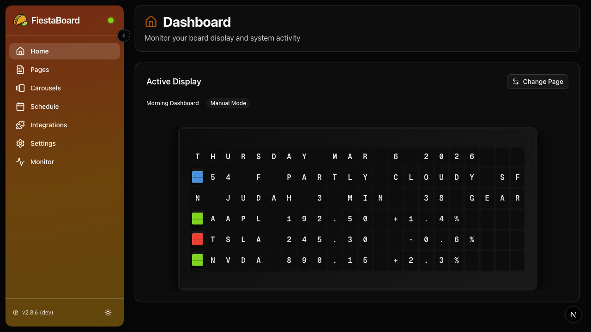

# FiestaBoard 

**FiestaBoard is an open-source server that lets you control what appears on your split-flap display.** If you already own a split-flap display (like a Vestaboard), FiestaBoard gives you a self-hosted platform with a plugin system to pull in data from the sources that matter to you — weather, stocks, transit, sports, surf conditions, and more — and display it on your board.

You bring the board. You bring the API keys for the services you care about. FiestaBoard handles the rest.

**📖 [Documentation](https://fiestaboard.app)**

## 🚀 Quick Start

### Prerequisites

- **A split-flap display** you already own and have set up
- **Your board's API key** (Local API or Cloud Read/Write key)
- **Docker and Docker Compose** installed ([Get Docker](https://www.docker.com/products/docker-desktop/))

That's it. No need to clone this repository — just pull the pre-built Docker images and go. Plugins that pull data from external services (weather, traffic, etc.) can be enabled and configured later through the web UI.

### Installation

FiestaBoard publishes pre-built Docker images to the **GitHub Container Registry** — you don't need to download the source code or build anything. Docker pulls the images for you:

```
ghcr.io/fiestaboard/fiestaboard-api:latest
ghcr.io/fiestaboard/fiestaboard-ui:latest
```

#### 1. Create a project folder

```bash
mkdir FiestaBoard && cd FiestaBoard
```

#### 2. Create a `docker-compose.yml`

Create a file called `docker-compose.yml` with the following contents:

```yaml
version: '3.8'
services:
  fiestaboard-api:
    image: ghcr.io/fiestaboard/fiestaboard-api:latest
    container_name: fiestaboard-api
    env_file: .env
    environment:
      - PRODUCTION=true
    restart: unless-stopped
    pull_policy: always
    ports:
      - "6969:8000"
    volumes:
      - ./data:/app/data

  fiestaboard-ui:
    image: ghcr.io/fiestaboard/fiestaboard-ui:latest
    container_name: fiestaboard-ui
    restart: unless-stopped
    pull_policy: always
    ports:
      - "4420:3000"
    environment:
      - FIESTA_API_URL=${FIESTA_API_URL:-}
    depends_on:
      - fiestaboard-api
```

#### 3. Create a `.env` file

Create a file called `.env` in the same folder. At a minimum, you need your board API key:

**Local API** (recommended — faster, supports animations):
```env
BOARD_API_MODE=local
BOARD_LOCAL_API_KEY=your_local_api_key_here
BOARD_HOST=192.168.0.11
```

**Cloud API** (works from anywhere):
```env
BOARD_API_MODE=cloud
BOARD_READ_WRITE_KEY=your_read_write_key_here
```

See [Getting Your Board API Key](#getting-your-board-api-key) below for how to get your key. All other settings — plugins, API keys, etc. — can be configured later through the web UI.

> For the full list of environment variables, see [`env.example`](./env.example).

#### 4. Start FiestaBoard

```bash
docker compose up -d
```

Docker will automatically pull the latest images from GHCR and start the services.

#### 5. Open the web UI

1. Open **http://localhost:4420** in your browser
2. Click "▶ Start Service"
3. Your board will start displaying content!



> **Ports:** The API runs on port **6969** and the Web UI on port **4420**. You can change these in your `docker-compose.yml`.

**Useful commands:**
```bash
# Stop FiestaBoard
docker compose down

# View logs
docker compose logs -f

# Pull latest images and restart
docker compose pull
docker compose up -d
```

### 🍓 Running on a Raspberry Pi?

The same pre-built images work on Raspberry Pi (arm64 and arm/v7) when a release includes Pi support. Just follow the steps above on your Pi. See the [Raspberry Pi Guide](./docs/deployment/PI_BUILD_GUIDE.md) for more details.

---

## Features

FiestaBoard uses a **plugin architecture** - each feature is a self-contained plugin with its own documentation. Browse the `plugins/` directory or use the web UI's **Integrations** page to discover and enable plugins.

### Available Plugins
- 💨 **[Air Quality & Fog](./plugins/air_fog/README.md)**: Monitor AQI and fog conditions
- 🚴 **[Bay Wheels](./plugins/baywheels/README.md)**: Track bike availability at multiple stations
- 📅 **[Date & Time](./plugins/date_time/README.md)**: Current date and time with multiple formats (12h/24h, US dates) and timezone autocomplete
- 🏰 **[Disney Park Queue Times](./plugins/disney_parks_times/README.md)**: Wait times for Disney parks and rides from Queue-Times.com
- 📶 **[Guest WiFi](./plugins/guest_wifi/README.md)**: Display WiFi credentials for guests
- 🏠 **[Home Assistant](./plugins/home_assistant/README.md)**: House status display (doors, garage, locks, etc.)
- 🎵 **[Last.fm Now Playing](./plugins/last_fm/README.md)**: Display currently playing music via Last.fm scrobbling
- 🚇 **[Muni Transit](./plugins/muni/README.md)**: Real-time SF Muni arrival predictions
- 🛩️ **[Nearby Aircraft](./plugins/nearby_aircraft/README.md)**: Real-time nearby aircraft information from OpenSky Network API
- 🏆 **[Sports Scores](./plugins/sports_scores/README.md)**: Display recent match scores from NFL, Soccer, NHL, and NBA
- ☀️ **[Sun Art](./plugins/sun_art/README.md)**: Full-screen sun art pattern that changes based on sun position throughout the day
- 🖖 **[Star Trek Quotes](./plugins/star_trek_quotes/README.md)**: Random quotes from TNG, Voyager, and DS9
- 📈 **[Stocks](./plugins/stocks/README.md)**: Monitor stock prices with color-coded indicators
- 🌊 **[Surf Conditions](./plugins/surf/README.md)**: Live surf reports with wave height and quality ratings
- 🚗 **[Traffic](./plugins/traffic/README.md)**: Travel time to destinations with live traffic
- 🕐 **[Visual Clock](./plugins/visual_clock/README.md)**: Full-screen clock with large pixel-art style digits
- 🌤️ **[Weather](./plugins/weather/README.md)**: Current conditions with temperature (F/C), UV index, precipitation chance, daily high/low, and sunset time
- 🚢 **[WSDOT](./plugins/wsdot/README.md)**: Washington State Ferries schedules, vessel names, car spots remaining, and alerts

**→ [Plugin Development Guide](./docs/development/PLUGIN_DEVELOPMENT.md)** - Create your own plugins!

### System Features
- ✏️ **Rich WYSIWYG Page Editor**: Create and edit pages with a what-you-see-is-what-you-get editor that shows exactly how content will appear on your board—template variables, colors, and alignment in real time
- 📅 **Schedule Mode**: Visual calendar to schedule which pages display when—set different pages for different times and days. Choose a default page for gaps in the schedule, or turn scheduling off to manually select the active page
- 📄 **Page-Based Display**: Create and select pages via the web UI
- 🔄 **Configurable Update Interval**: Adjust how often the board checks for new content (10-3600 seconds)
- ⚡ **Smart Preview Caching**: Page previews are cached (5 min TTL) for fast UI rendering, while active displays always get fresh data
- 🌙 **Silence Schedule**: Configure quiet hours when the board won't update
- 🐳 **Docker Ready**: Containerized for easy deployment on any system
- ⚙️ **Highly Configurable**: Configure plugins, API keys, and settings from the web UI
- 🔒 **Secure**: API token support for all integrations

---

## 👋 New to Technical Setup?

**Not comfortable with Docker or terminal commands?** Check out the step-by-step beginner's guide:

**→ [Beginner's Setup Guide](./docs/setup/BEGINNERS_GUIDE.md)**

---

## Hosting vs. Development

**Hosting a FiestaBoard server** (running it to control your board) and **developing FiestaBoard** (contributing code) are different workflows:

| | Hosting (Self-Hosting) | Development |
|---|---|---|
| **Goal** | Run the server to control your board | Contribute code or build plugins |
| **Setup** | Pull pre-built images from GHCR (see [Quick Start](#-quick-start)) | Clone repo, then `docker-compose -f docker-compose.dev.yml up --build` |
| **Configuration** | Edit `.env` with your board API key; plugins configured via web UI | Edit `.env` manually (see `env.example` for all options) |
| **Web UI** | http://localhost:4420 | http://localhost:3000 |
| **Hot reload** | No | Yes (Python + Next.js) |
| **Guide** | This README / [Beginner's Guide](./docs/setup/BEGINNERS_GUIDE.md) | [Local Development](./docs/setup/LOCAL_DEVELOPMENT.md) |

---

## Configuration

The [Quick Start](#-quick-start) guide walks you through creating a `.env` file from the template. After setup, everything else — plugins, API keys, and settings — is configured through the **web UI**.

Go to the **Integrations** page to enable plugins, enter API keys, and adjust settings. No need to edit config files.

> **For development:** If you're contributing code or building plugins, see `env.example` for the full list of environment variables. The [Environment Variables Reference](./docs-site/docs/reference/environment-variables.md) documents every option.

### Board Connection (set by wizard)

- `BOARD_API_MODE`: `local` (default) or `cloud` — how FiestaBoard connects to your board
- `BOARD_LOCAL_API_KEY` / `BOARD_HOST`: For local mode
- `BOARD_READ_WRITE_KEY`: For cloud mode

### Plugins

Plugins are enabled and configured through the web UI's **Integrations** page. Each plugin that connects to an external service needs its own API key — the Integrations page links to setup instructions and has fields to enter your keys.

| Plugin | API Key | Documentation |
|--------|---------|-------------|
| Weather | WeatherAPI.com or OpenWeatherMap | [plugins/weather/README.md](./plugins/weather/README.md) |
| Traffic | Google Routes API | [plugins/traffic/README.md](./plugins/traffic/README.md) |
| Home Assistant | HA long-lived access token | [plugins/home_assistant/README.md](./plugins/home_assistant/README.md) |
| Muni Transit | 511.org (free) | [plugins/muni/README.md](./plugins/muni/README.md) |
| Air/Fog | PurpleAir / OpenWeatherMap | [plugins/air_fog/README.md](./plugins/air_fog/README.md) |
| Stocks | Finnhub (optional) | [plugins/stocks/README.md](./plugins/stocks/README.md) |
| Nearby Aircraft | OpenSky (optional) | [plugins/nearby_aircraft/README.md](./plugins/nearby_aircraft/README.md) |
| Sports Scores | TheSportsDB (optional) | [plugins/sports_scores/README.md](./plugins/sports_scores/README.md) |
| Bay Wheels | None | [plugins/baywheels/README.md](./plugins/baywheels/README.md) |
| Date & Time | None | [plugins/date_time/README.md](./plugins/date_time/README.md) |
| Disney Parks | None | [plugins/disney_parks_times/README.md](./plugins/disney_parks_times/README.md) |
| Guest WiFi | None | [plugins/guest_wifi/README.md](./plugins/guest_wifi/README.md) |
| Star Trek Quotes | None | [plugins/star_trek_quotes/README.md](./plugins/star_trek_quotes/README.md) |
| Sun Art | None | [plugins/sun_art/README.md](./plugins/sun_art/README.md) |
| Surf | None | [plugins/surf/README.md](./plugins/surf/README.md) |
| Visual Clock | None | [plugins/visual_clock/README.md](./plugins/visual_clock/README.md) |
| WSDOT Ferries | WSDOT API key | [plugins/wsdot/README.md](./plugins/wsdot/README.md) |
| Last.fm | Last.fm API key | [plugins/last_fm/README.md](./plugins/last_fm/README.md) |

See `env.example` for all available environment variables.

## Local Development

If you want to contribute to FiestaBoard or build plugins, use the development environment:

```bash
docker-compose -f docker-compose.dev.yml up --build
# Web UI at http://localhost:3000 (hot reload)
# API at http://localhost:8000 (auto-reload)
```

For detailed development workflows, see [LOCAL_DEVELOPMENT.md](./docs/setup/LOCAL_DEVELOPMENT.md).

## How It Works

Select a page in the web UI and the service will keep it updated on your board. Pages use templates with dynamic data sources like weather, time, and more. Create custom pages to display exactly what you want.

## Project Structure

```
FiestaBoard/
├── plugins/                        # Plugin-based data sources
│   ├── _template/                  # Template for new plugins
│   ├── weather/                    # Weather plugin
│   ├── stocks/                     # Stocks plugin
│   ├── sports_scores/              # Sports scores plugin
│   ├── nearby_aircraft/           # Nearby aircraft plugin
│   ├── muni/                       # Muni transit plugin
│   └── .../                        # Other plugins
├── src/                            # Platform core (API, display service)
│   ├── api_server.py               # FastAPI REST API
│   ├── main.py                     # Display service core
│   ├── config.py                   # Configuration management
│   ├── board_client.py             # Board API client
│   ├── plugins/                    # Plugin system infrastructure
│   └── formatters/                 # Message formatting
├── web/                            # Next.js web UI
│   └── src/                        # React components and pages
├── docs/                           # Documentation
│   ├── setup/                      # Setup guides
│   ├── development/                # Plugin development guide
│   ├── deployment/                 # Deployment guides
│   └── reference/                  # API research and reference
├── scripts/                        # Utility scripts
├── tests/                          # Platform test suite
├── Dockerfile.api                  # API service Dockerfile
├── Dockerfile.ui                   # Web UI Dockerfile
├── docker-compose.yml              # Production compose (builds from source)
├── docker-compose.ghcr.yml         # Production compose (pre-built GHCR images)
├── docker-compose.dev.yml          # Development compose
└── .env                            # Environment variables
```

## Getting Your Board API Key

You need your board's API key before setting up FiestaBoard. There are two connection modes:

### Local API (Recommended)

Faster, supports transition animations, works over your local network.

1. Open the board's mobile app
2. Go to **Settings** → **Local API**
3. Copy your Local API key
4. Note your board's IP address

### Cloud API (Alternative)

Works from anywhere with internet. No transition animation support.

1. Go to [web.vestaboard.com](https://web.vestaboard.com)
2. Navigate to **Settings** → **API**
3. Enable **Read/Write API**
4. Copy your Read/Write API key

> The [Quick Start](#-quick-start) above walks you through creating `.env` with your board API key. If you're setting up manually (e.g., for development), see `env.example` for the variable names.

See [Cloud API Setup](./docs/setup/CLOUD_API_SETUP.md) for more details on cloud vs local mode.

## Deployment

### Hosting the Server (Pre-built Images — Recommended)

The easiest way to run FiestaBoard is to pull pre-built images from the GitHub Container Registry. See the [Quick Start](#-quick-start) above.

```bash
# Pull the latest images
docker pull ghcr.io/fiestaboard/fiestaboard-api:latest
docker pull ghcr.io/fiestaboard/fiestaboard-ui:latest

# Start the server
docker compose up -d

# Stop the server
docker compose down

# View logs
docker compose logs -f

# Update to the latest version
docker compose pull
docker compose up -d
```

### Building from Source (Alternative)

If you prefer to build from source (e.g., for customization), clone the repository and use the production compose file:

```bash
git clone https://github.com/Fiestaboard/FiestaBoard.git
cd FiestaBoard
cp env.example .env
# Edit .env with your board API key
docker compose up -d --build
```

### Production Deployment

- **[Raspberry Pi](./docs/deployment/PI_BUILD_GUIDE.md)**: Pull pre-built ARM images from GHCR
- **Docker Compose**: Pull pre-built images from GHCR (see [Quick Start](#-quick-start))


## Troubleshooting

### Board Not Updating

- Make sure you clicked "▶ Start Service" in the web UI
- Check your board API key in `.env` is correct
- Verify your `BOARD_API_MODE` matches the key type you're using
- For local mode: ensure your board is on the same network

### Docker Issues

- Ensure Docker is running: `docker ps`
- Check container logs: `docker-compose logs`
- Verify `.env` file exists and is readable

### Plugin Issues

- Check the plugin's setup guide: `plugins/<plugin_name>/docs/SETUP.md`
- Verify API keys are correct and don't have extra spaces
- Check API rate limits haven't been exceeded

## Documentation

**📖 Full documentation is available at [fiestaboard.app](https://fiestaboard.app)**

### Setup
- **[Beginner's Guide](./docs/setup/BEGINNERS_GUIDE.md)**: Step-by-step setup for non-technical users
- **[Docker Setup](./docs/setup/DOCKER_SETUP.md)**: Docker architecture details
- **[Cloud API Setup](./docs/setup/CLOUD_API_SETUP.md)**: Cloud API configuration

### Development
- **[Local Development](./docs/setup/LOCAL_DEVELOPMENT.md)**: Development environment for contributors
- **[Plugin Development Guide](./docs/development/PLUGIN_DEVELOPMENT.md)**: Create your own plugins

### Plugin Documentation
Each plugin includes its own docs:
- **Plugin README**: `plugins/<plugin>/README.md`
- **Setup guide**: `plugins/<plugin>/docs/SETUP.md`

### Deployment Guides
- **[Raspberry Pi](./docs/deployment/PI_BUILD_GUIDE.md)**: Build on Raspberry Pi

### Reference
- **[Character Codes](./docs/reference/CHARACTER_CODES.md)**: Board character reference
- **[Color Guide](./docs/reference/COLOR_GUIDE.md)**: Color coding reference

## Future Features

- 🌐 Webhook support for manual messages
- 📸 Custom image display
- 📊 Analytics and usage stats

## License

MIT License - see [LICENSE](./LICENSE) file for details.

## Screenshots

### Web UI


### Rich Page Editor (WYSIWYG)

Create and edit board pages with a rich editor that shows exactly what will appear on your split-flap display—template variables, colors, and formatting in real time.


### Schedule Mode

Use the visual calendar to schedule which page displays at which time. Set different pages for different times and days of the week. A default page fills any gaps when no slot is scheduled; you can also turn scheduling off and manually choose which page to show.


### Plugin Displays

**Stocks**: Monitor stock prices and percentage changes with color-coded indicators


**Nearby Aircraft**: Real-time nearby aircraft information with call signs, altitude, and ground speed


**Sports Scores**: Display recent match scores from NFL, Soccer, NHL, and NBA


**Weather**: Current conditions with temperature, UV index, precipitation chance, and daily high/low temperatures


### Other Available Features

The board can display various screens:

- **Weather + DateTime**: Current conditions with temperature (Fahrenheit/Celsius), UV index with color coding, precipitation chance, daily high/low temperatures, and sunset time
- **Home Assistant**: House status with green ([G]) and red ([R]) indicators
- **Star Trek Quotes**: Inspiring quotes from TNG, Voyager, and DS9
- **Guest WiFi**: SSID and password for guests
- **Air Quality & Fog**: Monitor AQI and fog conditions
- **Bay Wheels**: Track bike availability at multiple stations
- **Muni Transit**: Real-time SF Muni arrival predictions
- **Traffic**: Travel time to destinations with live traffic
- **Surf Conditions**: Live surf reports with wave height and quality ratings

**System Features:**
- **Silence Schedule**: Configure quiet hours when the board won't update (e.g., 8pm-7am)

## External Resources

- [Board API Docs](https://docs.vestaboard.com/docs/read-write-api/introduction)
- [WeatherAPI.com](https://www.weatherapi.com/)
- [OpenWeatherMap](https://openweathermap.org/api)
- [Home Assistant REST API](https://developers.home-assistant.io/docs/api/rest/)

## Considering a Vestaboard?

If you're thinking about buying a board, please consider using [my referral link](https://web.vestaboard.com/referral?vbref=ZDGYOT) for a $200 discount — it helps support this project at no extra cost to you.

## Support the Project

FiestaBoard is free and open source. If you find it useful and want to support continued development, consider buying me a coffee! ☕

<a href="https://www.buymeacoffee.com/fiestaboard" target="_blank"></a>

Your support helps maintain the project, add new features, and keep the documentation up to date. Every coffee is appreciated! 🙏

---
Made with ❤️ in San Francisco.
