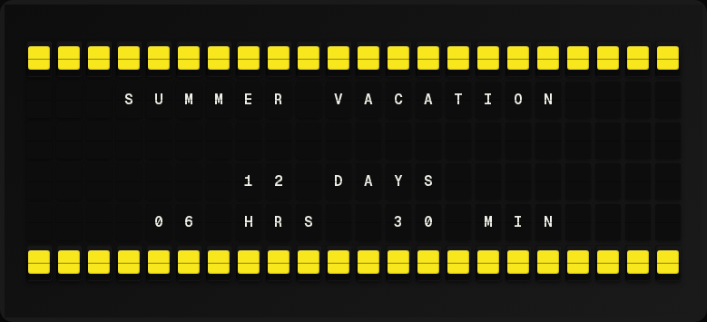

# Countdown Plugin Setup Guide

Configure a target date and time, then watch the days, hours, and minutes tick down on your board.

## Overview

**What it does:**

- Counts down to a target date and time in days, hours, minutes, and seconds
- Updates on every board refresh
- Switches to "Event has passed" once the target is reached
- Respects an IANA timezone of your choice

**Prerequisites:**

- None. The plugin runs locally with no external service or API key.

## Quick Setup

### 1. Enable the plugin

In the FiestaBoard web UI:

1. Open **Integrations**.
2. Find **Countdown** and toggle it on.

### 2. Configure the countdown

1. Click **Configure** on the Countdown card.
2. Set the **Event Name** — for example, `Last Day of School`.
3. Set the **Target Date & Time** in ISO 8601 format — for example, `2027-01-01T00:00:00`.
4. Set the **Timezone** (defaults to `America/Los_Angeles`). The picker autocompletes IANA names.
5. Click **Save Changes**.

### 3. Add countdown variables to a page

In **Pages**, create or edit a page template and add countdown variables. A minimal example:

```jinja
{center}COUNTDOWN UNTIL
{{countdown.event_name}}

{{countdown.days}} DAYS
{{countdown.hours}} HOURS
{{countdown.minutes}} MINUTES
```

### 4. View on your board

Save the page. On the next refresh, your board will show the countdown.



## Template Variables

| Variable | Description | Example |
|----------|-------------|---------|
| `{{countdown.event_name}}` | Configured event name | `Last Day of School` |
| `{{countdown.target_datetime}}` | Target datetime (ISO 8601) | `2027-01-01T00:00:00` |
| `{{countdown.days}}` | Whole days remaining | `86` |
| `{{countdown.hours}}` | Hours remaining (0–23) | `14` |
| `{{countdown.minutes}}` | Minutes remaining (0–59) | `30` |
| `{{countdown.seconds}}` | Seconds remaining (0–59) | `45` |
| `{{countdown.total_seconds}}` | Total seconds until target | `7473045` |
| `{{countdown.is_expired}}` | `"true"` once the target has passed | `"false"` |
| `{{countdown.formatted}}` | Pre-formatted summary | `86D 14H 30M` |

> **Note:** When `is_expired` is `"true"`, `formatted` becomes `Event has passed` and the day/hour/minute counters are `0`.

## Configuration Reference

### Settings

| Setting | Type | Required | Default | Description |
|---------|------|----------|---------|-------------|
| `enabled` | boolean | No | `false` | Enable or disable the plugin |
| `event_name` | string | No | `Event` | Name shown via `{{countdown.event_name}}` |
| `target_datetime` | string | Yes | — | Target date/time in ISO 8601 format (e.g. `2027-01-01T00:00:00`) |
| `timezone` | string | No | `America/Los_Angeles` | IANA timezone name |

### Environment variables

Each environment variable mirrors a setting and is used only when the corresponding UI field is empty:

```bash
COUNTDOWN_TARGET=2027-01-01T00:00:00
COUNTDOWN_EVENT_NAME=Last Day of School
```

> **Note:** The timezone cannot be set via an environment variable. Use the **Timezone** field in the UI to configure it.

## Troubleshooting

**Plugin shows "Not Available".**
The target date/time is missing. Set `target_datetime` in the UI or `COUNTDOWN_TARGET` in the environment.

**Countdown is off by several hours.**
The configured timezone does not match the timezone you intended for the target. Verify the IANA name (for example, `America/Los_Angeles`, not `PST`).

**Board shows "Event has passed".**
The target datetime is in the past. Update it to a future date and time.

**Configuration save fails with "Invalid target datetime format".**
The value must be ISO 8601 — `YYYY-MM-DDTHH:MM:SS`. For example, `2027-01-01T00:00:00`.
