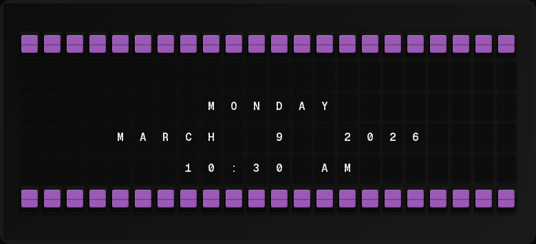

# Date & Time Plugin Setup Guide

Show the current date and time on your board — no API key, no external service.



## Overview

**What it does:**

- Displays the current date and time in your chosen IANA timezone
- Offers 12-hour and 24-hour clocks, US and ISO date formats, and individual date parts
- Includes a spoken-English time expression (`IT'S A QUARTER PAST ONE IN THE AFTERNOON.`)

**Prerequisites:**

- None. The plugin runs locally with no external service.

## Quick Setup

### 1. Enable the plugin

In the FiestaBoard web UI:

1. Open **Integrations**.
2. Find **Date & Time** and toggle it on. It is enabled by default in a fresh install.

### 2. Configure the timezone (optional)

The default timezone is `America/Los_Angeles`. To change it:

1. Click **Configure** on the Date & Time card.
2. Start typing in the **Timezone** field — the picker autocompletes IANA names (`America/New_York`, `Europe/London`, `Asia/Tokyo`).
3. Use the arrow keys to navigate, Enter to select, Escape to close.
4. Click **Save Changes**.

Or set it via environment variable. Add the line to your `.env` file in the project root (docker-compose reads this file automatically):

```bash
TIMEZONE=America/New_York
```

Then restart the container for the change to take effect:

```bash
docker-compose -f docker-compose.dev.yml down
docker-compose -f docker-compose.dev.yml up
```

> **Note:** Typing the bare assignment in your terminal shell has no effect on the container. The variable must be in the container environment — either in `.env`, under the `environment:` key in `docker-compose.yml`, or as a CLI prefix (`TIMEZONE=America/New_York docker-compose up`). See [Local Development](../../../docs/setup/LOCAL_DEVELOPMENT.md) for the full environment setup.

### 3. Add date/time variables to a page

In **Pages**, create or edit a page template and reference the variables you want:

```jinja
{center}{{date_time.day_of_week}}
{{date_time.date}}
{{date_time.time_12h}}
```

### 4. View on your board

Save the page. On the next refresh, the board renders the current date and time.


## Template Variables

### Time

| Variable | Description | Example |
|----------|-------------|---------|
| `{{date_time.time}}` | 24-hour time (`HH:MM`) | `14:30` |
| `{{date_time.time_24h}}` | Explicit alias of `time` | `14:30` |
| `{{date_time.time_12h}}` | 12-hour time with AM/PM | `2:30 PM` |
| `{{date_time.hour}}` | Hour, 0–23 | `14` |
| `{{date_time.minute}}` | Minute, 00–59 (zero-padded) | `30` |
| `{{date_time.timezone_abbr}}` | Timezone abbreviation | `PST` |
| `{{date_time.timezone}}` | Full IANA timezone name | `America/Los_Angeles` |

### Date

| Variable | Description | Example |
|----------|-------------|---------|
| `{{date_time.date}}` | ISO date (`YYYY-MM-DD`) | `2025-03-21` |
| `{{date_time.day_of_week}}` | Day name | `Friday` |
| `{{date_time.day_of_week_abbr}}` | Day name abbreviation | `Fri` |
| `{{date_time.day_of_week_num}}` | ISO day of week, 1-7 | `5` |
| `{{date_time.day_of_year}}` | Day of year, 1-366 | `80` |
| `{{date_time.day}}` | Day of month, 1–31 | `21` |
| `{{date_time.month}}` | Full month name | `March` |
| `{{date_time.month_abbr}}` | 3-letter month | `Mar` |
| `{{date_time.month_number}}` | Month, 1–12 | `3` |
| `{{date_time.month_number_padded}}` | Month, 01–12 | `03` |
| `{{date_time.week_of_year}}` | ISO week number, 1-53 | `12` |
| `{{date_time.quarter}}` | Quarter number, 1-4 | `1` |
| `{{date_time.year}}` | 4-digit year | `2025` |

### Formatted

| Variable | Description | Example |
|----------|-------------|---------|
| `{{date_time.datetime}}` | Date + 24h time | `2025-03-21 14:30` |
| `{{date_time.date_us}}` | US date (`MM/DD/YYYY`) | `03/21/2025` |
| `{{date_time.date_us_short}}` | Short US date (`MM/DD/YY`) | `03/21/25` |
| `{{date_time.time_english}}` | Spoken English time expression | `IT'S A QUARTER PAST ONE IN THE AFTERNOON.` |

## Configuration Reference

### Settings

| Setting | Type | Required | Default | Description |
|---------|------|----------|---------|-------------|
| `enabled` | boolean | No | `true` | Enable or disable the plugin |
| `timezone` | string | No | `America/Los_Angeles` | IANA timezone name |

### Environment variables

| Variable | Default | Description |
|----------|---------|-------------|
| `TIMEZONE` | `America/Los_Angeles` | IANA timezone, used when no `timezone` is set in the UI |

### Common IANA timezones

- `America/Los_Angeles` — Pacific Time (default)
- `America/Denver` — Mountain Time
- `America/Chicago` — Central Time
- `America/New_York` — Eastern Time
- `Europe/London` — UK Time
- `Europe/Paris` — Central European Time
- `Asia/Tokyo` — Japan Time
- `Australia/Sydney` — Australian Eastern Time

Full list: [IANA Time Zone Database](https://en.wikipedia.org/wiki/List_of_tz_database_time_zones).

## Troubleshooting

**Time is off by several hours.**
The configured timezone does not match the one you intended. Check the IANA name (for example, `America/Los_Angeles`, not `PST`).

**Configuration save fails with "Invalid timezone".**
The string is not a valid IANA name. Use the autocomplete picker rather than typing it freehand, and watch for typos.

**Time is not updating.**
Verify the plugin is enabled in **Integrations** and that the page template references at least one `date_time.*` variable. The board polls for new data on a fixed interval — to shorten it, open **Settings** and lower the **Board Update Interval** (default 15 seconds).

**`time_english` reads oddly between hours.**
The expression rounds to the nearest standard phrasing (`HALF PAST`, `A QUARTER PAST`, `A QUARTER TO`) and uses morning/afternoon/evening/night periods based on the hour. Minute 30 is always `HALF PAST`; minute 15 is always `A QUARTER PAST`.
