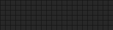

# Random Plugin

Display randomly selected values on your board, refreshed at a configurable interval.



**→ [Setup Guide](./docs/SETUP.md)**

## Overview

The Random plugin generates fresh random values on a schedule you control. It exposes three template variables: a pick from your own custom list of choices, a classic coin flip (Heads or Tails), and a random board color. Values are re-rolled at the configured refresh interval (default: every 60 seconds).

## Template Variables

### Selection

| Variable | Description | Example |
|----------|-------------|---------|
| `{{random.choice}}` | Randomly selected item from your configured choices list | `Option A` |

### Presets

| Variable | Description | Example |
|----------|-------------|---------|
| `{{random.coin_flip}}` | Coin flip result | `Heads` |
| `{{random.color}}` | Random board color as a rendered color tile (like `{{blue}}`) | _(colored square)_ |
| `{{random.color_name}}` | Random board color name as text | `green` |

> **Note:** Colors are limited to red, orange, yellow, green, blue, and violet. White and black are excluded because they render inverted on white-model boards, making the name label misleading.

## Example Templates

**Coin flip:**
```jinja
COIN FLIP
{{random.coin_flip}}
```

**Pick from a custom list:**
```jinja
TONIGHT'S DINNER
{{random.choice}}
```

**Random color tile:**
```jinja
{{random.color}}
```

**Color tile with name:**
```jinja
{{random.color}} {{random.color_name}}
```

**Combined:**
```jinja

FLIP: {{random.coin_flip}}
PICK: {{random.choice}}

COLOR: {{random.color}}

```

## Configuration

| Setting | Type | Default | Description |
|---------|------|---------|-------------|
| `enabled` | boolean | `true` | Enable or disable the plugin |
| `choices` | array of strings | `["Heads", "Tails"]` | 2–10 options for the `random.choice` variable |
| `refresh_seconds` | integer | `60` | How often to pick new random values (60–86400 seconds) |

## Features

- Pick a random item from any list of 2–10 strings you define
- Built-in coin flip (Heads / Tails) always available as `{{random.coin_flip}}`
- Random board color as a rendered tile (`{{random.color}}`) or as a text name (`{{random.color_name}}`) — picks from red, orange, yellow, green, blue, violet
- Configurable refresh interval — values change every N seconds

## Author

FiestaBoard Team
