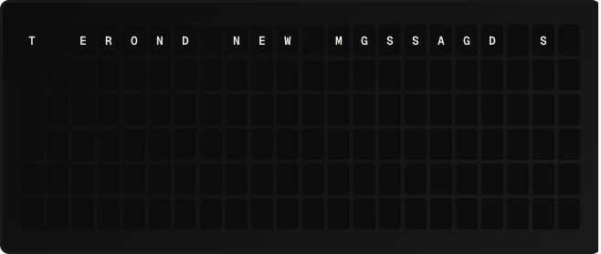

# Simple Dissolve Plugin

A transition plugin that replaces tiles in a random order, creating a gradual dissolve from the current message to the target.

**→ [Setup Guide](./docs/SETUP.md)**

## Overview

Simple Dissolve is a transition plugin -- it doesn't display its own content. When the active page changes, it animates the transition by flipping tiles one batch at a time in a random order, until the board matches the target.

Only tiles that actually differ between the current and target grids are flipped. Unchanged content stays in place throughout.

Each frame is drawn by FiestaBoard and sent as a normal board update, so Simple Dissolve runs on any board connection — unlike the built-in strategies (Wave, Edges to Center, and the rest), which are Vestaboard Local API features.

## Template Variables

None. Transition plugins don't expose template variables.

## Example Templates

Simple Dissolve isn't referenced from a template. Once the **Transition Plugins** beta is on (Settings → Advanced → Beta Features), pick it from the **Transition** dropdown in the page editor's toolbar for a single page, or from Settings → Behavior → Board Transitions for every page. A page's own setting wins over the global default; "Use global default" clears it.

Pages store the choice as `transition_strategy = "plugin:simple_dissolve"`.

## Configuration

| Setting               | Type    | Default | Description                                                                |
| --------------------- | ------- | ------- | -------------------------------------------------------------------------- |
| `tiles_per_frame`     | integer | 6       | Tiles flipped per step (1-132). Larger = faster.                            |
| `frame_interval_ms`   | integer | 100     | Pause between steps in milliseconds (0-2000).                               |
| `seed`                | integer | 0       | Fixed integer for deterministic order (useful for previews). 0 = random.   |

## Features

- Animates only the tiles that change; unchanged content stays put
- Random shuffle each run (or seeded for predictable previews)
- Works on any board connection, Local API or Cloud
- Bounded: capped at 200 frames / 60 seconds runtime
- Interruptible: a new page or trigger cancels the in-flight dissolve cleanly

## Author

FiestaBoard
