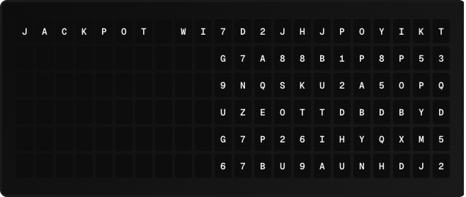

# Slot Machine Plugin

A transition plugin where each column "spins" through random characters like a slot-machine reel before locking on the target. Columns stagger left-to-right so the board settles in a satisfying cascade.

**→ [Setup Guide](./docs/SETUP.md)**

## Overview

Slot Machine is a transition plugin -- it doesn't display its own content. When the active page changes, each column of the board spins through a sequence of random tile codes (mimicking a flap reel cycling) and then locks on the target. The stagger setting controls how much later each column starts locking than the previous one, producing a left-to-right cascade.

This plugin plays to the unique nature of the Vestaboard's split-flap mechanism: where hardware transitions like "wave" or "edges-to-center" simply *move* the final state into place, Slot Machine animates the *flaps themselves* as if the board were a row of mechanical reels.

## Template Variables

None. Transition plugins don't expose template variables.

## Example Templates

Select Slot Machine from a page's Transition picker or set it as the global default in Settings → Transitions.

## Configuration

| Setting               | Type    | Default | Description                                                                              |
| --------------------- | ------- | ------- | ---------------------------------------------------------------------------------------- |
| `spin_frames`         | integer | 6       | Random-character frames each column shows before locking (1-30).                          |
| `column_stagger`      | integer | 1       | Frames between adjacent column locks (0-10). 0 = simultaneous, higher = more pronounced cascade. |
| `frame_interval_ms`   | integer | 80      | Pause between frames in milliseconds (0-1000). Smaller = faster spin.                     |
| `seed`                | integer | 0       | Fixed integer for deterministic playback (useful for previews). 0 = fresh random.        |

## Features

- Visually striking flap-reel effect that plays to the Vestaboard's mechanical character
- Tunable cascade pattern via `column_stagger`
- Random spin per run (or seeded for predictable previews)
- Bounded: capped at 300 frames / 60 seconds runtime
- Interruptible: a new page or trigger cancels the in-flight spin cleanly

## Author

FiestaBoard
