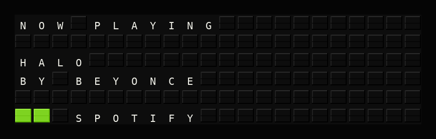

# Spotify Now Playing Setup Guide

This guide will help you set up the Spotify Now Playing plugin for FiestaBoard.



## Prerequisites

- A Spotify account (free or Premium)
- A Spotify Developer application (free)
- A one-time OAuth authorization to obtain a refresh token

## Step 1: Create a Spotify Developer Application

1. Go to the [Spotify Developer Dashboard](https://developer.spotify.com/dashboard)
2. Log in with your Spotify account
3. Click **Create App**
4. Fill in the form:
   - **App name**: FiestaBoard (or any name you prefer)
   - **App description**: Personal music display
   - **Redirect URI**: `http://localhost:8888/callback`
   - **Which API/SDKs are you planning to use?**: Web API
5. Click **Save**
6. On your app page, note the **Client ID**
7. Click **Settings** then **View client secret** to get the **Client Secret**

## Step 2: Obtain a Refresh Token

You need to perform a one-time OAuth authorization to get a refresh token. The refresh token is long-lived and allows FiestaBoard to request new access tokens automatically.

### Option A: Using the Authorization URL

1. Open a browser and navigate to the following URL (replace `YOUR_CLIENT_ID`):

   ```
   https://accounts.spotify.com/authorize?client_id=YOUR_CLIENT_ID&response_type=code&redirect_uri=http://localhost:8888/callback&scope=user-read-currently-playing
   ```

2. Log in and click **Agree** to authorize your app
3. You'll be redirected to `http://localhost:8888/callback?code=AUTHORIZATION_CODE`
4. Copy the `code` parameter from the URL
5. Exchange the code for tokens using curl (replace the placeholders):

   ```bash
   curl -X POST https://accounts.spotify.com/api/token \
     -H "Content-Type: application/x-www-form-urlencoded" \
     -d grant_type=authorization_code \
     -d code=YOUR_AUTHORIZATION_CODE \
     -d redirect_uri=http://localhost:8888/callback \
     -d client_id=YOUR_CLIENT_ID \
     -d client_secret=YOUR_CLIENT_SECRET
   ```

6. The response will contain a `refresh_token` — save this value

### Option B: Using a Helper Tool

There are third-party tools online that can help generate a Spotify refresh token. However, **we strongly recommend Option A above** (the manual process) as it keeps your credentials entirely under your control.

> **⚠️ Security Warning**: Third-party token generators require your Spotify authorization code and may have access to your account. Only use tools you fully trust and understand. FiestaBoard does not endorse any third-party tool.

## Step 3: Configure FiestaBoard

### Option A: Via Web UI

1. Open FiestaBoard web interface
2. Go to **Integrations**
3. Find **Spotify Now Playing** and click to configure
4. Enter your **Client ID**
5. Enter your **Client Secret**
6. Enter your **Refresh Token**
7. Adjust refresh interval if desired (default: 30 seconds)
8. Enable the plugin

### Option B: Via Environment Variables

Add to your `.env` file or Docker environment:

```env
SPOTIFY_CLIENT_ID=your_client_id_here
SPOTIFY_CLIENT_SECRET=your_client_secret_here
SPOTIFY_REFRESH_TOKEN=your_refresh_token_here
```

Then enable the plugin in the UI.

## Step 4: Verify It's Working

1. Play a song on Spotify (any device)
2. Wait a few seconds for FiestaBoard to pick up the track
3. Your Vestaboard should display the currently playing song!

## Using in Templates

Once configured, you can use these variables in your templates:

```
{{spotify.title}}       - Song title
{{spotify.artist}}      - Artist name
{{spotify.album}}       - Album name
{{spotify.is_playing}}  - true if currently playing
{{spotify.status}}      - "NOW PLAYING" or "PAUSED"
{{spotify.formatted}}   - "Song Title by Artist"
```

### Example Template

```
{{spotify.status}}

{{spotify.title}}
by {{spotify.artist}}
```

## Troubleshooting

### "Failed to obtain access token"

1. **Check credentials**: Verify your Client ID, Client Secret, and Refresh Token
2. **Regenerate refresh token**: The refresh token may have been revoked — repeat Step 2
3. **Check app status**: Ensure your app is still active in the [Developer Dashboard](https://developer.spotify.com/dashboard)

### "Authentication failed"

1. Your access token expired and the refresh failed
2. Check that your Client Secret hasn't changed
3. Regenerate the refresh token

### "Access forbidden"

1. The `user-read-currently-playing` scope wasn't granted during authorization
2. Repeat Step 2 and ensure the scope is included in the authorization URL

### Shows "PAUSED" instead of "NOW PLAYING"

This means Spotify playback is paused on all devices. Resume playback on any Spotify app to see "NOW PLAYING".

### Nothing appears on the board

1. **Check Spotify is playing**: Open the Spotify app and verify playback is active
2. **Verify credentials**: Double-check Client ID, Client Secret, and Refresh Token
3. **Check plugin is enabled**: Go to Integrations and ensure the plugin is toggled on

## Privacy Note

This plugin only reads your currently playing track. It does not:
- Access your Spotify password
- Modify your Spotify account or playlists
- Share your listening data with anyone
- Access your listening history

Your credentials are stored locally in your FiestaBoard configuration.
