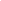

# Typewriter Plugin

A transition plugin that reveals the target message left-to-right, character by character, like an old typewriter.

**→ [Setup Guide](./docs/SETUP.md)**

## Overview

Typewriter is a transition plugin -- it doesn't display its own content. Instead, when one page replaces another on the board, Typewriter animates the change by revealing the new content one tile at a time, sweeping left-to-right and top-to-bottom.

## Template Variables

None. Transition plugins don't expose template variables; they shape *how* a board update happens, not *what* it shows.

## Example Templates

Transition plugins are selected per page from the page editor's "Transition" picker (or globally from Settings → Transitions). They aren't placed in templates directly.

## Configuration

| Setting               | Type    | Default | Description                                              |
| --------------------- | ------- | ------- | -------------------------------------------------------- |
| `chars_per_frame`     | integer | 1       | Tiles flipped per step (1-22). Larger = faster.          |
| `frame_interval_ms`   | integer | 120     | Pause between steps in milliseconds (0-2000).            |

## Features

- Smooth left-to-right reveal of the target grid
- Tunable speed: choose how many tiles per step and how long between steps
- Bounded: capped at 200 frames / 60 seconds runtime
- Interruptible: a new page or trigger cancels the in-flight typewriter cleanly

## Author

FiestaBoard
